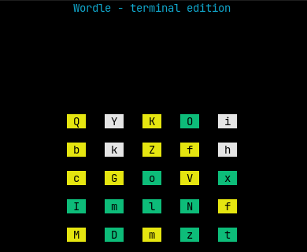

# terminal-wordle

## Under develpoment !!!

  **Wordle, inside the terminal.**
  

## Game rules!

You have 5 attempts to guess the correct word.
Each guess must be a valid english word.

After submitting a word, each letter will turn green, yellow, or red.

- **Green:** The letter is correct, and in the correct position.
- **Yellow:** The letter is exists in the chosen word, but is in the wrong position.
- **Red:** The letter is not exists in the chosen word at all.
